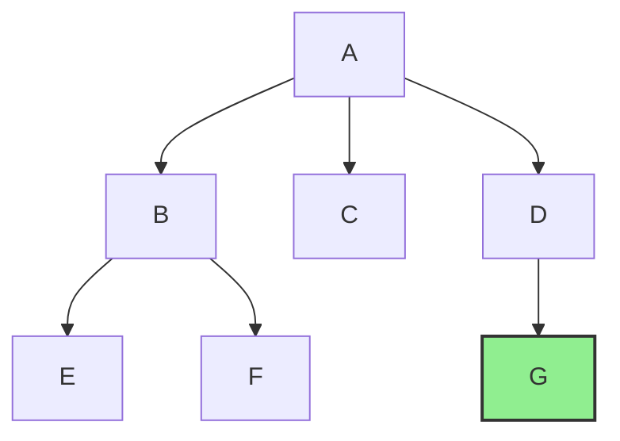

# 🤖 Aula 06 - Busca sem infomação


## **Material da aula**

*
* **Capítulo 1 - RUSSELL, Stuart J.; NORVIG, Peter.** _Inteligência Artificial: Uma Abordagem Moderna._ 3. ed. São Paulo: Prentice Hall, 2010.&#x20;


##

## :books: **Referências Bibliográficas**

* **RUSSELL, Stuart J.; NORVIG, Peter.** _Inteligência Artificial: Uma Abordagem Moderna._ 3. ed. São Paulo: Prentice Hall, 2010

