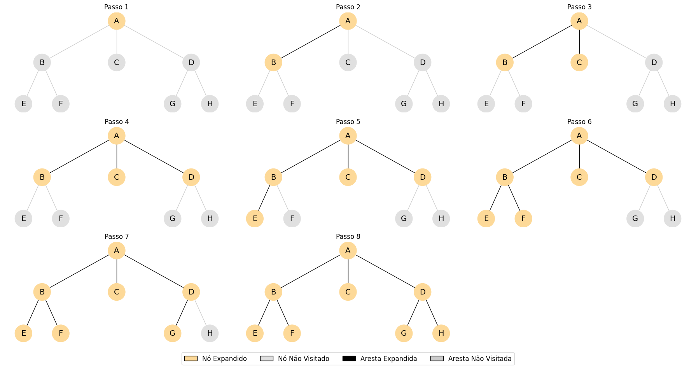
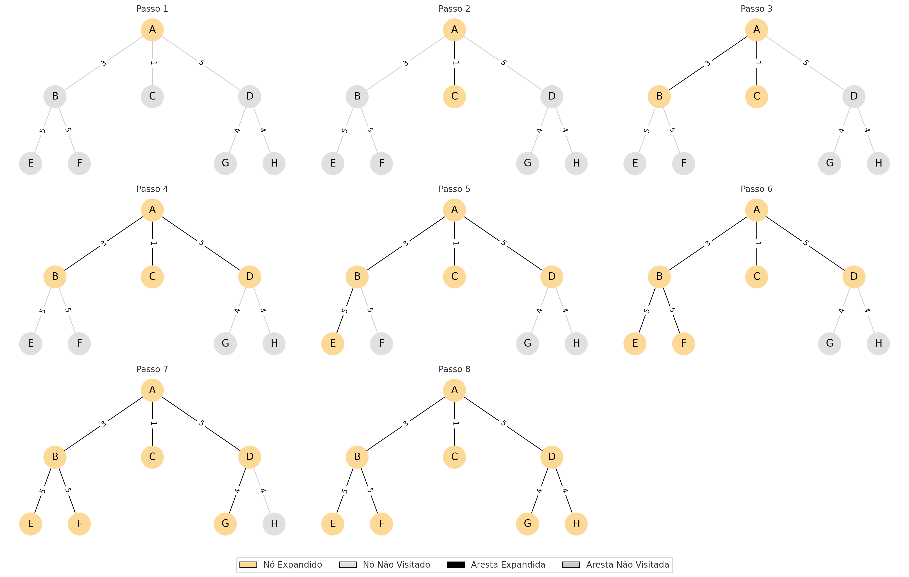
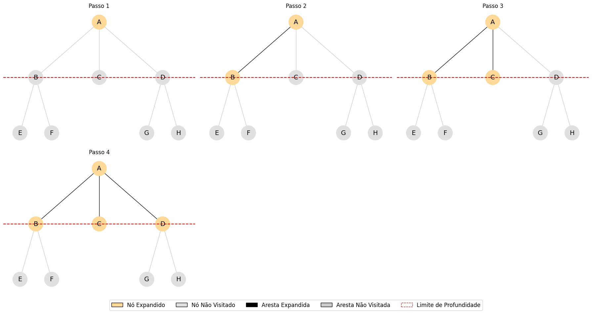

# 🗺️ Aula 06 - Busca sem informação


## **Material da aula**

* Slides
* **Capítulo 3.5 - RUSSELL, Stuart J.; NORVIG, Peter.** _Inteligência Artificial: Uma Abordagem Moderna._ 3. ed. São Paulo: Prentice Hall, 2010.&#x20;


## 1. Introdução

A ideia é expandir nós da árvore de busca de forma sistemática até encontrar o estado objetivo. Estratégias de busca **sem informação** usam apenas os dados da definição do problema.

***

## 2. Definição Formal de um Problema de Busca

Um problema de busca pode ser definido por:

* **Estado Inicial:** $$s_0$$
* **Ações Possíveis:** $$A(s)$$
* **Modelo de Transição:** $$T(s, a) \rightarrow s'$$
* **Teste de Objetivo:** $$G(s)$$
* **Função de Custo de Caminho:** $$C(s, a, s')$$

***

## 3. Estratégias de Busca Sem Informação

São diferenciadas pela **ordem de expansão dos nós**. As principais são:

1. Busca em largura (Breadth-First Search)
2. Busca de custo uniforme (Uniform-Cost Search)
3. Busca em profundidade (Depth-First Search)
4. Busca em profundidade limitada
5. Busca de aprofundamento iterativo

### 2.1 Busca em Largura

A Busca em Largura é um algoritmo de busca cega que explora todos os nós de um nível antes de prosseguir para o próximo. Utiliza uma estrutura de dados do tipo fila (_queue_), implementada em geral por busca em largura em grafos ou árvores.&#x20;

#### Funcionamento

1. Insere o nó inicial na fila.
2. Enquanto a fila não estiver vazia:
   * Remove o nó da frente.
   * Verifica se é o objetivo.
   * Se não for, insere todos os seus filhos na fila.

<figure><figcaption></figcaption></figure>

#### Características

* Completude: **Sim**, se o espaço de estados for finito.
* Otimalidade: **Sim**, se o custo de cada ação for igual.
*   Complexidade de tempo: $$O(b^d)$$

    Complexidade de espaço: $$O(b^d)$$

> Onde:\
> $$b$$ = fator de ramificação\
> $$d$$ = profundidade da solução mais rasa

### 2.2 Busca de Custo Uniforme&#x20;

Variante da busca em largura que leva em consideração o custo cumulativo do caminho até o nó atual. Utiliza uma fila de prioridade, ordenada pelo custo total acumulado $$g(n)$$.

#### Funcionamento

1. Insere o nó inicial com custo zero.
2. Enquanto a fila de prioridade não estiver vazia:
   * Remove o nó com menor custo acumulado.
   * Se for o objetivo, retorna a solução.
   * Caso contrário, insere os filhos com seus respectivos custos acumulados.

<figure><figcaption></figcaption></figure>

#### Características

* Completude: **Sim**, se os custos forem positivos.
* Otimalidade: **Sim**, pois sempre expande o caminho de menor custo.
* Complexidade de tempo: $$O(b^{1+⌊C^∗/ϵ⌋)})$$
* Complexidade de espaço: mesma da complexidade de tempo.

> Onde:&#x20;
>
> * $$C^*$$ = custo da solução ótima
> * $$\epsilon$$ = menor custo entre dois nós consecutivos

### 2.3 Busca em Profundidade&#x20;

Explora o caminho mais profundo possível antes de retroceder. Utiliza uma pilha (_stack_) como estrutura de controle.

#### Funcionamento

1. Insere o nó inicial na pilha.
2. Enquanto a pilha não estiver vazia:
   * Remove o nó do topo.
   * Verifica se é o objetivo.
   * Se não for, insere seus filhos no topo da pilha.

<figure><figcaption></figcaption></figure>

#### Características

* Completude: **Não**, em espaços infinitos ou com ciclos.
* Otimalidade: **Não**, pode retornar uma solução não ótima.
* Complexidade de tempo: $$O(b^m)$$
* Complexidade de espaço: $$O(b^m)$$

> Onde:&#x20;
>
> * $$m$$ = profundidade máxima da árvore

### 2.4 Busca em Profundidade Limitada

Extensão da busca em profundidade que impõe um limite $$l$$ à profundidade máxima de exploração. Evita os problemas de ciclo e de espaços infinitos da busca em profundidade.

#### Funcionamento

Igual à busca em profundidade, com a restrição de que não se expande nós com profundidade maior que $$l$$.

<figure><figcaption></figcaption></figure>

#### Características

* Completude: **Sim**, se $$l \ge d$$ (sendo $$d$$ a profundidade da solução).
* Otimalidade: **Não**, a menos que $$l = d$$ e todos os custos sejam iguais.
* Complexidade de tempo: $$O(b^l)$$
* Complexidade de espaço: $$O(b^l)$$

### 2.5 Busca de Aprofundamento Iterativo

Combina as vantagens da busca em profundidade (baixo uso de memória) com a completude e otimalidade da busca em largura. Executa várias buscas em profundidade limitada com limites crescentes.

#### Funcionamento

1. Para cada limite $$l$$ de 0 até $$d$$:
   * Executa busca em largura com profundidade $$l$$.
   * Interrompe se a solução for encontrada.

#### Características

* Completude: **Sim**, para espaços finitos.
* Otimalidade: **Sim**, se o custo for uniforme.
* Complexidade de tempo: $$O(b^d)$$
* Complexidade de espaço: $$O(bd)$$

***

## 3. Estados Repetidos

A expansão de nós repetidos pode causar:

* **Loops infinitos**
* **Complexidade exponencial desnecessária**

#### Solução:

* Utilizar uma **estrutura de visitados** para evitar reexploração de nós.
* Aplicável principalmente em busca em **grafo**, não apenas árvore.

***

## 4. Comparativo das Estratégias

<table><thead><tr><th width="228.5">Algoritmo</th><th width="138">Completude</th><th width="130.5">Otimalidade</th><th width="128">Tempo</th><th>Espaço</th></tr></thead><tbody><tr><td>Busca em largura</td><td>Sim</td><td>Sim (custo uniforme)</td><td>\mathcal{O}(b^d)</td><td>\mathcal{O}(b^d)</td></tr><tr><td>Busca de custo uniforme</td><td>Sim</td><td>Sim</td><td>\mathcal{O}\left(b^{1 + \frac{C^*}{\varepsilon}}\right)</td><td>\mathcal{O}\left(b^{1 + \frac{C^*}{\varepsilon}}\right)</td></tr><tr><td>Busca em profundidade</td><td>Não</td><td>Não</td><td>\mathcal{O}(b^m)</td><td>\mathcal{O}(bm)</td></tr><tr><td>Busca em profundidade limitada</td><td>Sim (se l \geq d)</td><td>Não</td><td>\mathcal{O}(b^l)</td><td>\mathcal{O}(bl)</td></tr><tr><td>Busca de aprofundamento iterativo</td><td>Sim</td><td>Sim (custo uniforme)</td><td>\mathcal{O}(b^d)</td><td>\mathcal{O}(bd)</td></tr></tbody></table>

## :books: **Referências Bibliográficas**

* **RUSSELL, Stuart J.; NORVIG, Peter.** _Inteligência Artificial: Uma Abordagem Moderna._ 3. ed. São Paulo: Prentice Hall, 2010
