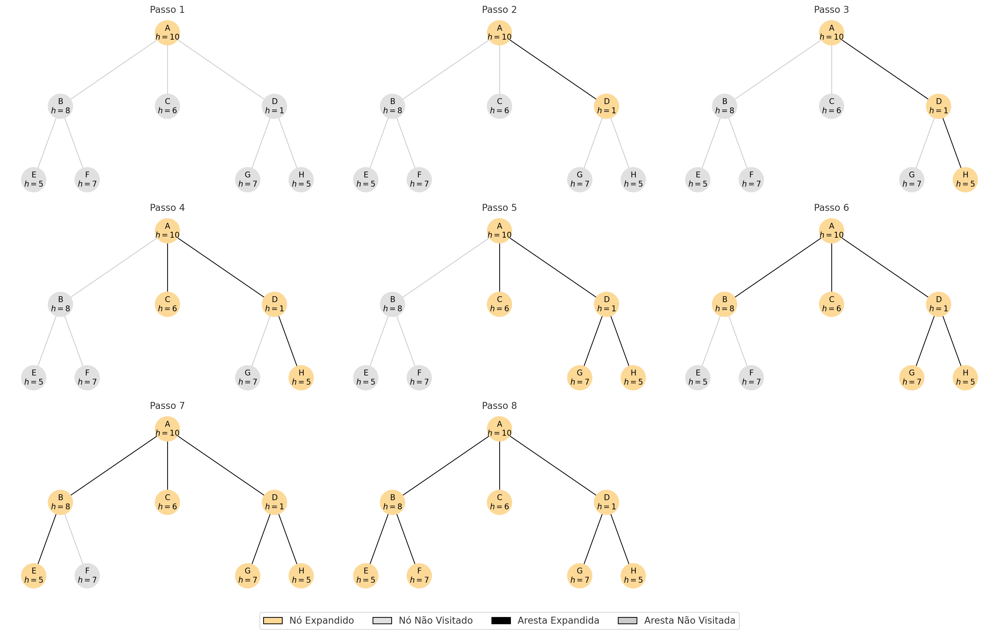
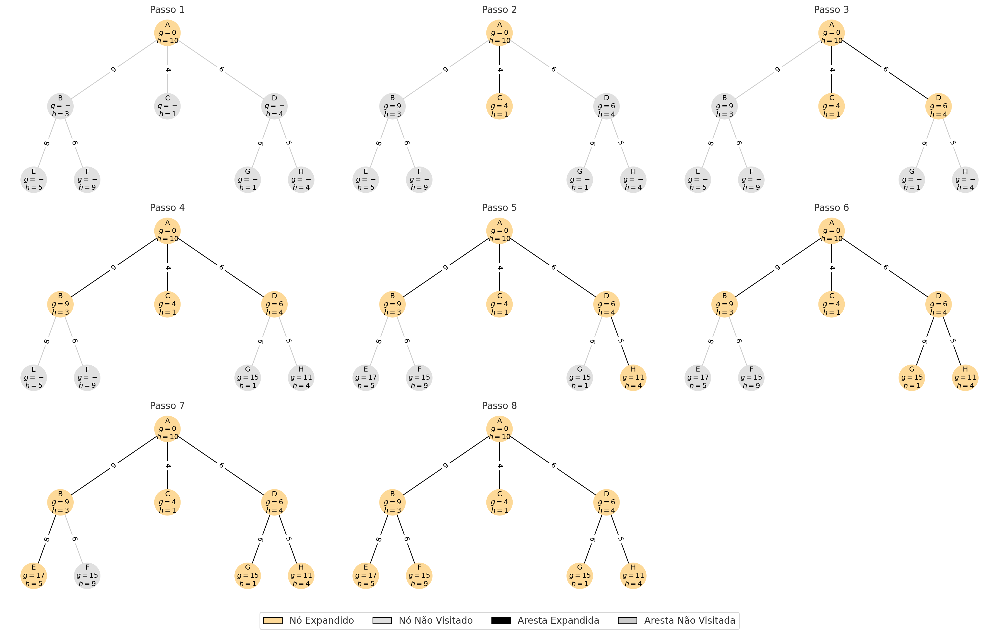

# 🧭 Aula 07 - Busca com informação


## **Material da aula**

* Slides
* **Capítulo 3.6 - 3.7 - RUSSELL, Stuart J.; NORVIG, Peter.** _Inteligência Artificial: Uma Abordagem Moderna._ 3. ed. São Paulo: Prentice Hall, 2010.&#x20;


## 1. Introdução

A busca informada é caracterizada pelo uso de uma **função heurística** $$h(n)$$ que estima o custo do caminho restante do estado atual nn até o objetivo. Essa estimativa permite orientar a expansão de nós de forma mais eficiente que nas buscas não informadas, potencialmente reduzindo o espaço de busca.

***

## 2. Estratégias de Busca com Informação

### 2.1 Busca Gulosa&#x20;

Algoritmo que utiliza apenas a heurística $$h(n)$$ como critério de seleção, sempre expandindo o nó mais “promissor” segundo essa estimativa. Ignora o custo acumulado do caminho.

#### Funcionamento

1. Insere o nó inicial na fila de prioridade com prioridade $$h(n)$$.
2. Em cada iteração:
   * Remove o nó com menor valor de $$h(n)$$.
   * Se for o objetivo, encerra.
   * Caso contrário, insere os sucessores na fila com prioridade baseada apenas em  $$h(n)$$.

<figure><figcaption></figcaption></figure>

#### Características

* Completude: **Não garantida** (pode entrar em ciclos).
* Otimalidade: **Não** (não considera custos reais).
* Complexidade de tempo e espaço: Dependente da qualidade de  $$h(n)$$; pior caso é $$\mathcal{O}(b^m)$$.
* Vantagem: Pode encontrar soluções rapidamente com boas heurísticas.
* Desvantagem: Pode ignorar caminhos mais baratos.

### 2.2  Algoritmo A\*&#x20;

Algoritmo que combina custo acumulado $$g(n)$$ com estimativa heurística $$h(n)$$ por meio da função de avaliação:

$$
f(n)=g(n)+h(n)
$$

#### Funcionamento

1. Insere o nó inicial na fila de prioridade com $$f(n)=g(n)+h(n)$$.
2. Em cada iteração:
   * Remove o nó com menor valor de f(n)f(n).
   * Se for o objetivo, encerra.
   * Caso contrário, expande os sucessores, atualizando $$g(n)$$ e reavaliando $$f(n)$$.

<figure><figcaption></figcaption></figure>

#### Requisitos para Otimalidade

Para que o A\* seja **completo** e **ótimo**, é necessário que:

* A heurística seja **admissível**, ou seja: $$\forall n, h(n) \leq h^*(n)$$

> Onde $$h^*(n)$$ é o custo real do caminho mais barato de $$n$$ até o objetivo.

* Para maior eficiência, a heurística também deve ser **consistente (monótona)**:$$\forall n, n', h(n) \leq c(n, n') + h(n')$$

> Onde $$c(n, n')$$ é o custo da ação entre $$n$$ e $$n'$$.

#### Características

* Completude: **Sim**, se o número de nós for finito e $$h(n)$$ admissível.
* Otimalidade: **Sim**, se $$h(n)$$ for admissível.
* Complexidade de tempo e espaço: Exponencial no pior caso, $$\mathcal{O}(b^d)$$, mas mais eficiente que busca em largura e busca de custo uniforme com boa heurística.

***

## 3. Tabela Comparativa

<table><thead><tr><th width="128">Algoritmo</th><th width="179.5">Usa heurística?</th><th width="112.5">Completude</th><th width="113">Otimalidade</th><th width="99.5">Tempo</th><th width="100">Espaço</th></tr></thead><tbody><tr><td>Busca Gulosa</td><td>Sim (h(n))</td><td>Não</td><td>Não</td><td>\mathcal{O}(b^m)</td><td>\mathcal{O}(b^m)</td></tr><tr><td>A*</td><td>Sim (g(n) + h(n))</td><td>Sim</td><td>Sim (se h admissível)</td><td>\mathcal{O}(b^d)</td><td>\mathcal{O}(b^d)</td></tr></tbody></table>

***

## 4. Considerações sobre Heurísticas

Uma **boa heurística** deve ser:

* **Admissível**: nunca superestimar o custo real.
* **Consistente**: satisfazer a desigualdade de monotonicidade.
* **Barata de calcular**: não deve ser mais custosa que expandir o nó.

#### Exemplos de heurísticas comuns:

<table><thead><tr><th width="218">Problema</th><th>Heurística admissível</th></tr></thead><tbody><tr><td>Quebra-cabeça 8</td><td>Número de peças fora do lugar</td></tr><tr><td>Labirinto</td><td>Distância Manhattan até o objetivo</td></tr><tr><td>Roteamento de rede</td><td>Distância em linha reta (euclidiana)</td></tr></tbody></table>

***

## :books: **Referências Bibliográficas**

* **RUSSELL, Stuart J.; NORVIG, Peter.** _Inteligência Artificial: Uma Abordagem Moderna._ 3. ed. São Paulo: Prentice Hall, 2010
