# Page 1

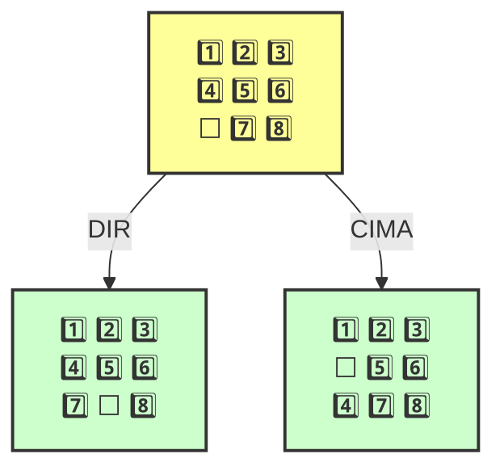

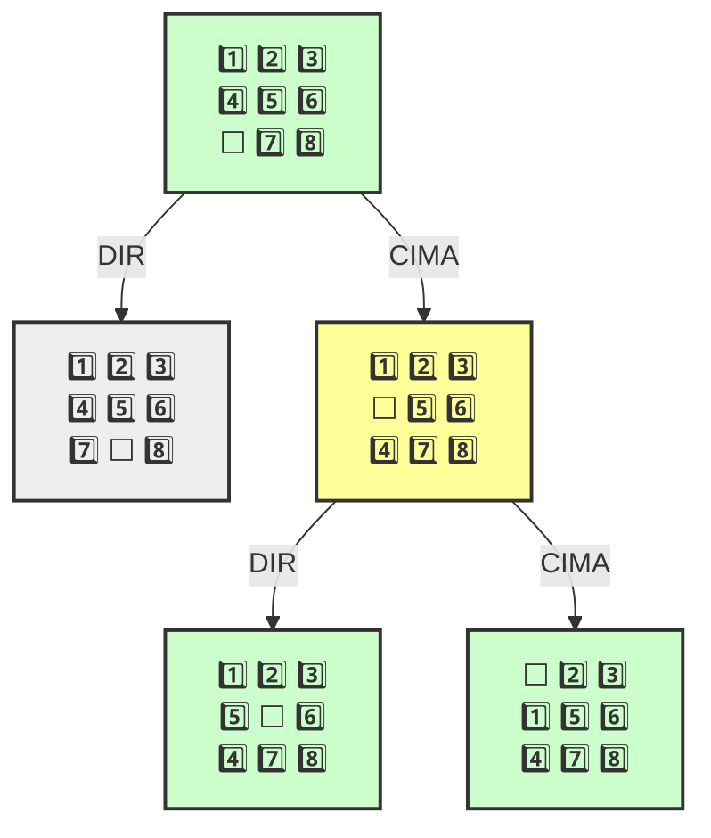

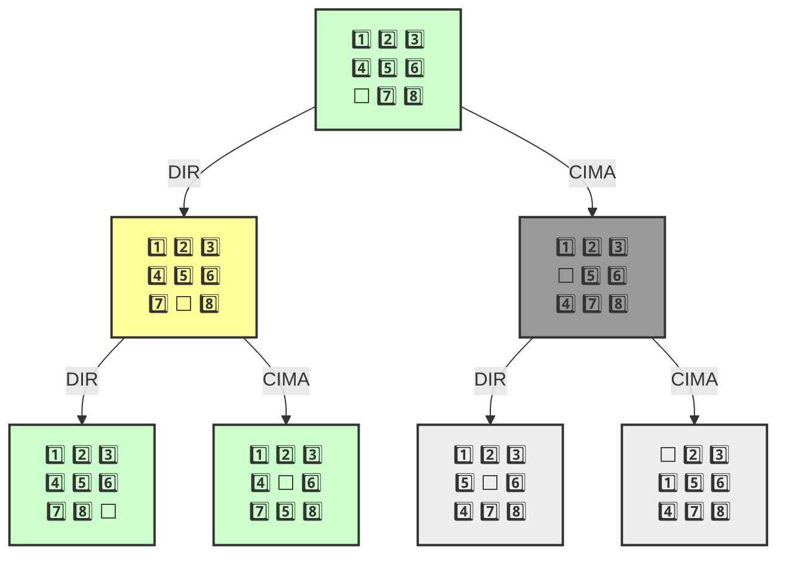

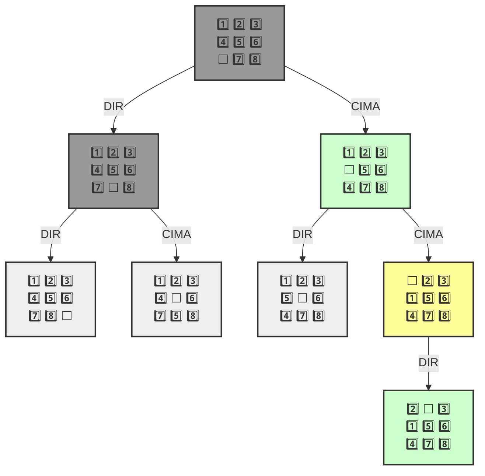


````
```mermaid

    
```


```mermaid

    
```
```mermaid

    
```
```mermaid

    
```
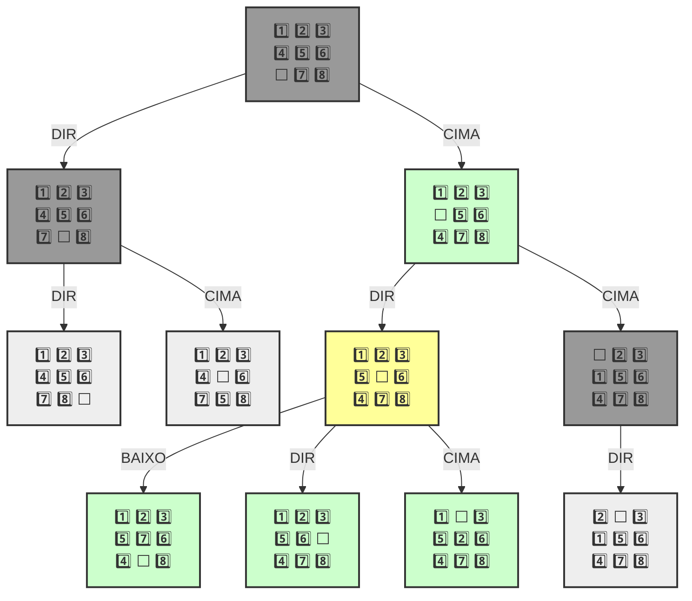
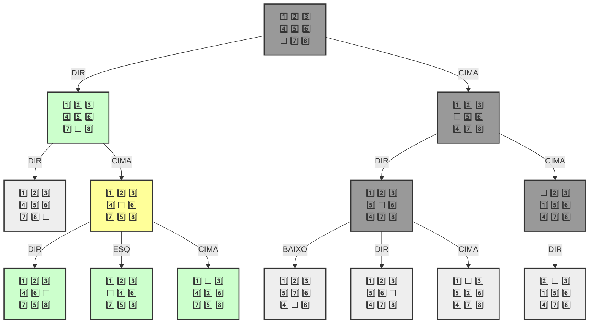
🎯 Objetivo encontrado!

1️⃣ 2️⃣ 3️⃣
4️⃣ 5️⃣ 6️⃣
⬜ 7️⃣ 8️⃣ 
---
1️⃣ 2️⃣ 3️⃣
4️⃣ 5️⃣ 6️⃣
7️⃣ ⬜ 8️⃣ 
---
1️⃣ 2️⃣ 3️⃣
4️⃣ 5️⃣ 6️⃣
7️⃣ 8️⃣ ⬜ 
---
````

```
[<__main__.Estado at 0x7b23677e6d90>,
 <__main__.Estado at 0x7b23677979d0>,
 <__main__.Estado at 0x7b2367797b10>]
```


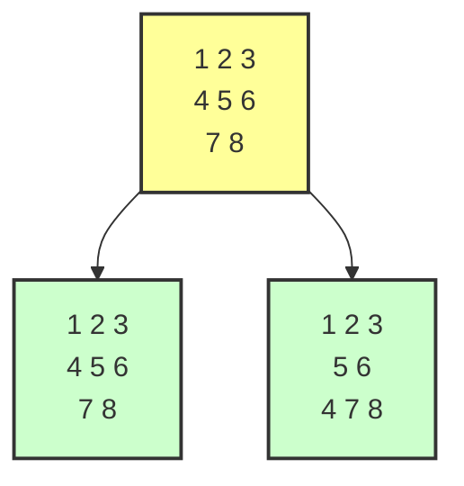


````
```mermaid

    
```
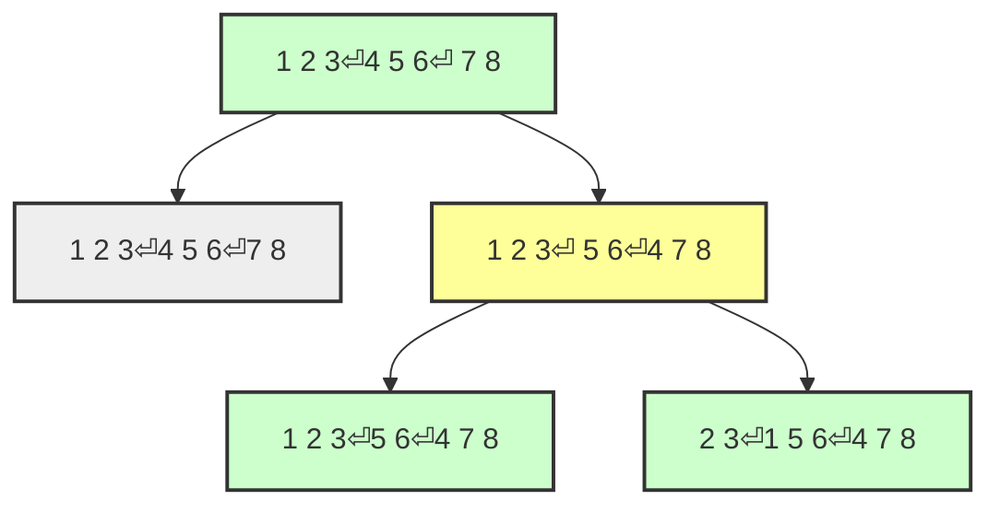
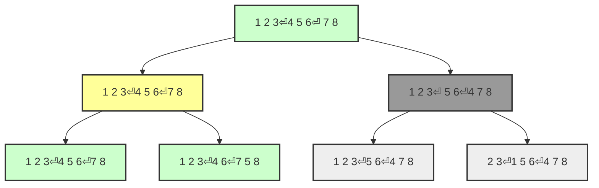
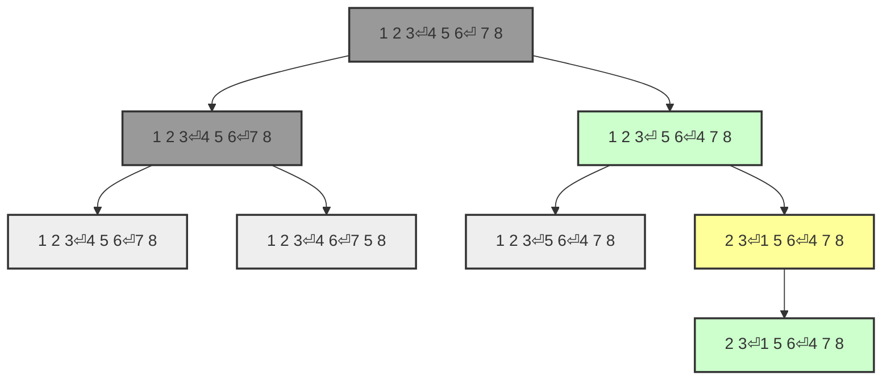
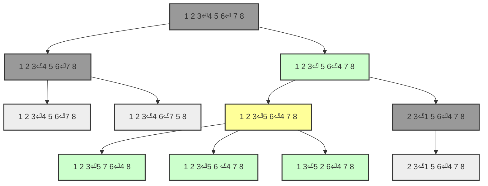
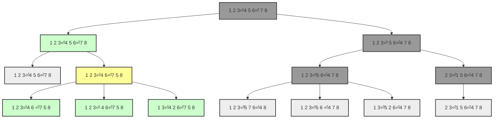
🎯 Objetivo encontrado!

1 2 3
4 5 6
  7 8 
---
1 2 3
4 5 6
7   8 
---
1 2 3
4 5 6
7 8   
---
````

```
[<__main__.Estado at 0x7b2364613390>,
 <__main__.Estado at 0x7b23677a9e10>,
 <__main__.Estado at 0x7b2364613a90>]
```

