```mermaid
graph TD
E135391990086416["1️⃣ 2️⃣ 3️⃣<br>4️⃣ 5️⃣ 6️⃣<br>7️⃣ 8️⃣ ⬜"]
class E135391990086416 lightgray;
E135391990086672["1️⃣ 2️⃣ 3️⃣<br>5️⃣ ⬜ 6️⃣<br>4️⃣ 7️⃣ 8️⃣"]
class E135391990086672 yellow;
E135391990081936["1️⃣ 2️⃣ 3️⃣<br>5️⃣ 7️⃣ 6️⃣<br>4️⃣ ⬜ 8️⃣"]
class E135391990081936 lightgreen;
E135391990085136["1️⃣ 2️⃣ 3️⃣<br>5️⃣ 6️⃣ ⬜<br>4️⃣ 7️⃣ 8️⃣"]
class E135391990085136 lightgreen;
E135391990086096["1️⃣ 2️⃣ 3️⃣<br>4️⃣ 5️⃣ 6️⃣<br>7️⃣ ⬜ 8️⃣"]
class E135391990086096 gray;
E135391990400528["1️⃣ 2️⃣ 3️⃣<br>⬜ 5️⃣ 6️⃣<br>4️⃣ 7️⃣ 8️⃣"]
class E135391990400528 lightgreen;
E135391990083536["1️⃣ 2️⃣ 3️⃣<br>4️⃣ ⬜ 6️⃣<br>7️⃣ 5️⃣ 8️⃣"]
class E135391990083536 lightgray;
E135391990084880["2️⃣ ⬜ 3️⃣<br>1️⃣ 5️⃣ 6️⃣<br>4️⃣ 7️⃣ 8️⃣"]
class E135391990084880 lightgray;
E135391990239632["⬜ 2️⃣ 3️⃣<br>1️⃣ 5️⃣ 6️⃣<br>4️⃣ 7️⃣ 8️⃣"]
class E135391990239632 gray;
E135391990410640["1️⃣ 2️⃣ 3️⃣<br>4️⃣ 5️⃣ 6️⃣<br>⬜ 7️⃣ 8️⃣"]
class E135391990410640 gray;
E135391990086160["1️⃣ ⬜ 3️⃣<br>5️⃣ 2️⃣ 6️⃣<br>4️⃣ 7️⃣ 8️⃣"]
class E135391990086160 lightgreen;
E135391990086096 -- "DIR" --> E135391990086416
E135391990400528 -- "DIR" --> E135391990086672
E135391990086672 -- "BAIXO" --> E135391990081936
E135391990086672 -- "DIR" --> E135391990085136
E135391990410640 -- "DIR" --> E135391990086096
E135391990410640 -- "CIMA" --> E135391990400528
E135391990086096 -- "CIMA" --> E135391990083536
E135391990239632 -- "DIR" --> E135391990084880
E135391990400528 -- "CIMA" --> E135391990239632
E135391990086672 -- "CIMA" --> E135391990086160

    classDef yellow fill:#ffff99,stroke:#333,stroke-width:2px;
    classDef lightgreen fill:#ccffcc,stroke:#333,stroke-width:2px;
    classDef gray fill:#999999,stroke:#333,stroke-width:2px;
    classDef lightgray fill:#eeeeee,stroke:#333,stroke-width:2px;
    
```

```mermaid
graph TD
E135391990114640["1️⃣ 2️⃣ 3️⃣<br>4️⃣ 6️⃣ ⬜<br>7️⃣ 5️⃣ 8️⃣"]
class E135391990114640 lightgreen;
E135391990086416["1️⃣ 2️⃣ 3️⃣<br>4️⃣ 5️⃣ 6️⃣<br>7️⃣ 8️⃣ ⬜"]
class E135391990086416 lightgray;
E135391990086672["1️⃣ 2️⃣ 3️⃣<br>5️⃣ ⬜ 6️⃣<br>4️⃣ 7️⃣ 8️⃣"]
class E135391990086672 gray;
E135391990081936["1️⃣ 2️⃣ 3️⃣<br>5️⃣ 7️⃣ 6️⃣<br>4️⃣ ⬜ 8️⃣"]
class E135391990081936 lightgray;
E135391990113360["1️⃣ 2️⃣ 3️⃣<br>⬜ 4️⃣ 6️⃣<br>7️⃣ 5️⃣ 8️⃣"]
class E135391990113360 lightgreen;
E135391990085136["1️⃣ 2️⃣ 3️⃣<br>5️⃣ 6️⃣ ⬜<br>4️⃣ 7️⃣ 8️⃣"]
class E135391990085136 lightgray;
E135391990082192["1️⃣ ⬜ 3️⃣<br>4️⃣ 2️⃣ 6️⃣<br>7️⃣ 5️⃣ 8️⃣"]
class E135391990082192 lightgreen;
E135391990086096["1️⃣ 2️⃣ 3️⃣<br>4️⃣ 5️⃣ 6️⃣<br>7️⃣ ⬜ 8️⃣"]
class E135391990086096 lightgreen;
E135391990400528["1️⃣ 2️⃣ 3️⃣<br>⬜ 5️⃣ 6️⃣<br>4️⃣ 7️⃣ 8️⃣"]
class E135391990400528 gray;
E135391990083536["1️⃣ 2️⃣ 3️⃣<br>4️⃣ ⬜ 6️⃣<br>7️⃣ 5️⃣ 8️⃣"]
class E135391990083536 yellow;
E135391990084880["2️⃣ ⬜ 3️⃣<br>1️⃣ 5️⃣ 6️⃣<br>4️⃣ 7️⃣ 8️⃣"]
class E135391990084880 lightgray;
E135391990239632["⬜ 2️⃣ 3️⃣<br>1️⃣ 5️⃣ 6️⃣<br>4️⃣ 7️⃣ 8️⃣"]
class E135391990239632 gray;
E135391990410640["1️⃣ 2️⃣ 3️⃣<br>4️⃣ 5️⃣ 6️⃣<br>⬜ 7️⃣ 8️⃣"]
class E135391990410640 gray;
E135391990086160["1️⃣ ⬜ 3️⃣<br>5️⃣ 2️⃣ 6️⃣<br>4️⃣ 7️⃣ 8️⃣"]
class E135391990086160 lightgray;
E135391990083536 -- "DIR" --> E135391990114640
E135391990086096 -- "DIR" --> E135391990086416
E135391990400528 -- "DIR" --> E135391990086672
E135391990086672 -- "BAIXO" --> E135391990081936
E135391990083536 -- "ESQ" --> E135391990113360
E135391990086672 -- "DIR" --> E135391990085136
E135391990083536 -- "CIMA" --> E135391990082192
E135391990410640 -- "DIR" --> E135391990086096
E135391990410640 -- "CIMA" --> E135391990400528
E135391990086096 -- "CIMA" --> E135391990083536
E135391990239632 -- "DIR" --> E135391990084880
E135391990400528 -- "CIMA" --> E135391990239632
E135391990086672 -- "CIMA" --> E135391990086160

    classDef yellow fill:#ffff99,stroke:#333,stroke-width:2px;
    classDef lightgreen fill:#ccffcc,stroke:#333,stroke-width:2px;
    classDef gray fill:#999999,stroke:#333,stroke-width:2px;
    classDef lightgray fill:#eeeeee,stroke:#333,stroke-width:2px;
    
```

```mermaid
graph TD
E135392339786256["1 2 3⏎5   6⏎4 7 8"]
class E135392339786256 lightgreen;
E135391990160912["1 2 3⏎4 5 6⏎7   8"]
class E135391990160912 lightgray;
E135391990249872["1 2 3⏎  5 6⏎4 7 8"]
class E135391990249872 yellow;
E135391990194000["  2 3⏎1 5 6⏎4 7 8"]
class E135391990194000 lightgreen;
E135391938163600["1 2 3⏎4 5 6⏎  7 8"]
class E135391938163600 lightgreen;
E135391990249872 --> E135392339786256
E135391938163600 --> E135391990160912
E135391938163600 --> E135391990249872
E135391990249872 --> E135391990194000

    classDef yellow fill:#ffff99,stroke:#333,stroke-width:2px;
    classDef lightgreen fill:#ccffcc,stroke:#333,stroke-width:2px;
    classDef gray fill:#999999,stroke:#333,stroke-width:2px;
    classDef lightgray fill:#eeeeee,stroke:#333,stroke-width:2px;
    
```

```mermaid
graph TD
E135391938165392["1 2 3⏎4 5 6⏎7 8  "]
class E135391938165392 lightgray;
E135392339786256["1 2 3⏎5   6⏎4 7 8"]
class E135392339786256 yellow;
E135391938166032["1 2 3⏎5 7 6⏎4   8"]
class E135391938166032 lightgreen;
E135391938166160["1 2 3⏎5 6  ⏎4 7 8"]
class E135391938166160 lightgreen;
E135391990160912["1 2 3⏎4 5 6⏎7   8"]
class E135391990160912 gray;
E135391990249872["1 2 3⏎  5 6⏎4 7 8"]
class E135391990249872 lightgreen;
E135391990265936["1 2 3⏎4   6⏎7 5 8"]
class E135391990265936 lightgray;
E135391938164048["2   3⏎1 5 6⏎4 7 8"]
class E135391938164048 lightgray;
E135391990194000["  2 3⏎1 5 6⏎4 7 8"]
class E135391990194000 gray;
E135391938163600["1 2 3⏎4 5 6⏎  7 8"]
class E135391938163600 gray;
E135391938166096["1   3⏎5 2 6⏎4 7 8"]
class E135391938166096 lightgreen;
E135391990160912 --> E135391938165392
E135391990249872 --> E135392339786256
E135392339786256 --> E135391938166032
E135392339786256 --> E135391938166160
E135391938163600 --> E135391990160912
E135391938163600 --> E135391990249872
E135391990160912 --> E135391990265936
E135391990194000 --> E135391938164048
E135391990249872 --> E135391990194000
E135392339786256 --> E135391938166096

    classDef yellow fill:#ffff99,stroke:#333,stroke-width:2px;
    classDef lightgreen fill:#ccffcc,stroke:#333,stroke-width:2px;
    classDef gray fill:#999999,stroke:#333,stroke-width:2px;
    classDef lightgray fill:#eeeeee,stroke:#333,stroke-width:2px;
    
```

# Page 1

```mermaid
graph TD
E135391990086096["1️⃣ 2️⃣ 3️⃣<br>4️⃣ 5️⃣ 6️⃣<br>7️⃣ ⬜ 8️⃣"]
class E135391990086096 lightgreen;
E135391990400528["1️⃣ 2️⃣ 3️⃣<br>⬜ 5️⃣ 6️⃣<br>4️⃣ 7️⃣ 8️⃣"]
class E135391990400528 lightgreen;
E135391990410640["1️⃣ 2️⃣ 3️⃣<br>4️⃣ 5️⃣ 6️⃣<br>⬜ 7️⃣ 8️⃣"]
class E135391990410640 yellow;
E135391990410640 -- "DIR" --> E135391990086096
E135391990410640 -- "CIMA" --> E135391990400528

    classDef yellow fill:#ffff99,stroke:#333,stroke-width:2px;
    classDef lightgreen fill:#ccffcc,stroke:#333,stroke-width:2px;
    classDef gray fill:#999999,stroke:#333,stroke-width:2px;
    classDef lightgray fill:#eeeeee,stroke:#333,stroke-width:2px;
```

```mermaid
graph TD
E135391990086672["1️⃣ 2️⃣ 3️⃣<br>5️⃣ ⬜ 6️⃣<br>4️⃣ 7️⃣ 8️⃣"]
class E135391990086672 lightgreen;
E135391990086096["1️⃣ 2️⃣ 3️⃣<br>4️⃣ 5️⃣ 6️⃣<br>7️⃣ ⬜ 8️⃣"]
class E135391990086096 lightgray;
E135391990400528["1️⃣ 2️⃣ 3️⃣<br>⬜ 5️⃣ 6️⃣<br>4️⃣ 7️⃣ 8️⃣"]
class E135391990400528 yellow;
E135391990239632["⬜ 2️⃣ 3️⃣<br>1️⃣ 5️⃣ 6️⃣<br>4️⃣ 7️⃣ 8️⃣"]
class E135391990239632 lightgreen;
E135391990410640["1️⃣ 2️⃣ 3️⃣<br>4️⃣ 5️⃣ 6️⃣<br>⬜ 7️⃣ 8️⃣"]
class E135391990410640 lightgreen;
E135391990400528 -- "DIR" --> E135391990086672
E135391990410640 -- "DIR" --> E135391990086096
E135391990410640 -- "CIMA" --> E135391990400528
E135391990400528 -- "CIMA" --> E135391990239632

    classDef yellow fill:#ffff99,stroke:#333,stroke-width:2px;
    classDef lightgreen fill:#ccffcc,stroke:#333,stroke-width:2px;
    classDef gray fill:#999999,stroke:#333,stroke-width:2px;
    classDef lightgray fill:#eeeeee,stroke:#333,stroke-width:2px;
```

```mermaid
graph TD
E135391990086672["1️⃣ 2️⃣ 3️⃣<br>5️⃣ ⬜ 6️⃣<br>4️⃣ 7️⃣ 8️⃣"]
class E135391990086672 lightgray;
E135391990086416["1️⃣ 2️⃣ 3️⃣<br>4️⃣ 5️⃣ 6️⃣<br>7️⃣ 8️⃣ ⬜"]
class E135391990086416 lightgreen;
E135391990086096["1️⃣ 2️⃣ 3️⃣<br>4️⃣ 5️⃣ 6️⃣<br>7️⃣ ⬜ 8️⃣"]
class E135391990086096 yellow;
E135391990400528["1️⃣ 2️⃣ 3️⃣<br>⬜ 5️⃣ 6️⃣<br>4️⃣ 7️⃣ 8️⃣"]
class E135391990400528 gray;
E135391990083536["1️⃣ 2️⃣ 3️⃣<br>4️⃣ ⬜ 6️⃣<br>7️⃣ 5️⃣ 8️⃣"]
class E135391990083536 lightgreen;
E135391990239632["⬜ 2️⃣ 3️⃣<br>1️⃣ 5️⃣ 6️⃣<br>4️⃣ 7️⃣ 8️⃣"]
class E135391990239632 lightgray;
E135391990410640["1️⃣ 2️⃣ 3️⃣<br>4️⃣ 5️⃣ 6️⃣<br>⬜ 7️⃣ 8️⃣"]
class E135391990410640 lightgreen;
E135391990400528 -- "DIR" --> E135391990086672
E135391990086096 -- "DIR" --> E135391990086416
E135391990410640 -- "DIR" --> E135391990086096
E135391990410640 -- "CIMA" --> E135391990400528
E135391990086096 -- "CIMA" --> E135391990083536
E135391990400528 -- "CIMA" --> E135391990239632

    classDef yellow fill:#ffff99,stroke:#333,stroke-width:2px;
    classDef lightgreen fill:#ccffcc,stroke:#333,stroke-width:2px;
    classDef gray fill:#999999,stroke:#333,stroke-width:2px;
    classDef lightgray fill:#eeeeee,stroke:#333,stroke-width:2px;
```

```mermaid
graph TD
E135391990086672["1️⃣ 2️⃣ 3️⃣<br>5️⃣ ⬜ 6️⃣<br>4️⃣ 7️⃣ 8️⃣"]
class E135391990086672 lightgray;
E135391990086416["1️⃣ 2️⃣ 3️⃣<br>4️⃣ 5️⃣ 6️⃣<br>7️⃣ 8️⃣ ⬜"]
class E135391990086416 lightgray;
E135391990086096["1️⃣ 2️⃣ 3️⃣<br>4️⃣ 5️⃣ 6️⃣<br>7️⃣ ⬜ 8️⃣"]
class E135391990086096 gray;
E135391990400528["1️⃣ 2️⃣ 3️⃣<br>⬜ 5️⃣ 6️⃣<br>4️⃣ 7️⃣ 8️⃣"]
class E135391990400528 lightgreen;
E135391990083536["1️⃣ 2️⃣ 3️⃣<br>4️⃣ ⬜ 6️⃣<br>7️⃣ 5️⃣ 8️⃣"]
class E135391990083536 lightgray;
E135391990084880["2️⃣ ⬜ 3️⃣<br>1️⃣ 5️⃣ 6️⃣<br>4️⃣ 7️⃣ 8️⃣"]
class E135391990084880 lightgreen;
E135391990239632["⬜ 2️⃣ 3️⃣<br>1️⃣ 5️⃣ 6️⃣<br>4️⃣ 7️⃣ 8️⃣"]
class E135391990239632 yellow;
E135391990410640["1️⃣ 2️⃣ 3️⃣<br>4️⃣ 5️⃣ 6️⃣<br>⬜ 7️⃣ 8️⃣"]
class E135391990410640 gray;
E135391990400528 -- "DIR" --> E135391990086672
E135391990086096 -- "DIR" --> E135391990086416
E135391990410640 -- "DIR" --> E135391990086096
E135391990410640 -- "CIMA" --> E135391990400528
E135391990086096 -- "CIMA" --> E135391990083536
E135391990239632 -- "DIR" --> E135391990084880
E135391990400528 -- "CIMA" --> E135391990239632

    classDef yellow fill:#ffff99,stroke:#333,stroke-width:2px;
    classDef lightgreen fill:#ccffcc,stroke:#333,stroke-width:2px;
    classDef gray fill:#999999,stroke:#333,stroke-width:2px;
    classDef lightgray fill:#eeeeee,stroke:#333,stroke-width:2px;
```










````
```mermaid

    
```


```mermaid

    
```
```mermaid

    
```
```mermaid

    
```


🎯 Objetivo encontrado!

1️⃣ 2️⃣ 3️⃣
4️⃣ 5️⃣ 6️⃣
⬜ 7️⃣ 8️⃣ 
---
1️⃣ 2️⃣ 3️⃣
4️⃣ 5️⃣ 6️⃣
7️⃣ ⬜ 8️⃣ 
---
1️⃣ 2️⃣ 3️⃣
4️⃣ 5️⃣ 6️⃣
7️⃣ 8️⃣ ⬜ 
---
````

```
[<__main__.Estado at 0x7b23677e6d90>,
 <__main__.Estado at 0x7b23677979d0>,
 <__main__.Estado at 0x7b2367797b10>]
```


````
```mermaid

    
```





🎯 Objetivo encontrado!

1 2 3
4 5 6
  7 8 
---
1 2 3
4 5 6
7   8 
---
1 2 3
4 5 6
7 8   
---
````

```
[<__main__.Estado at 0x7b2364613390>,
 <__main__.Estado at 0x7b23677a9e10>,
 <__main__.Estado at 0x7b2364613a90>]
```

