# Page 2

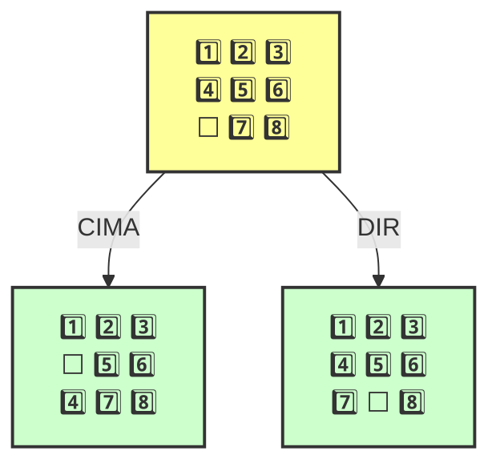

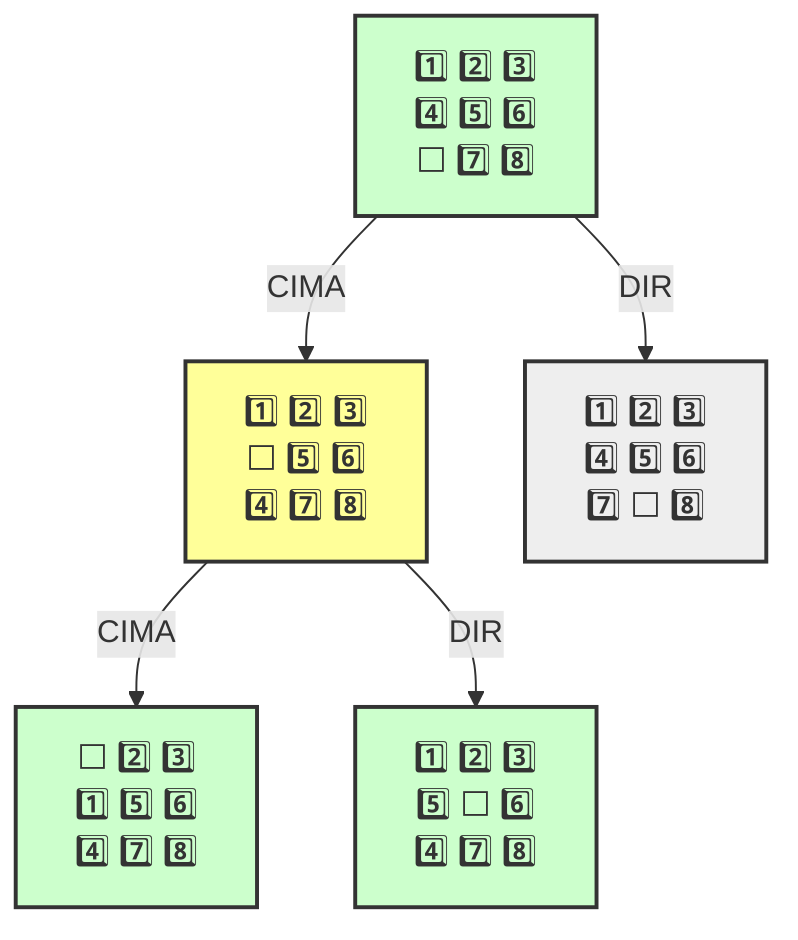

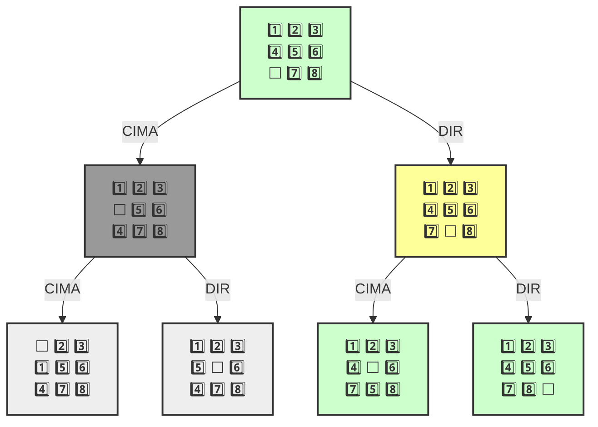

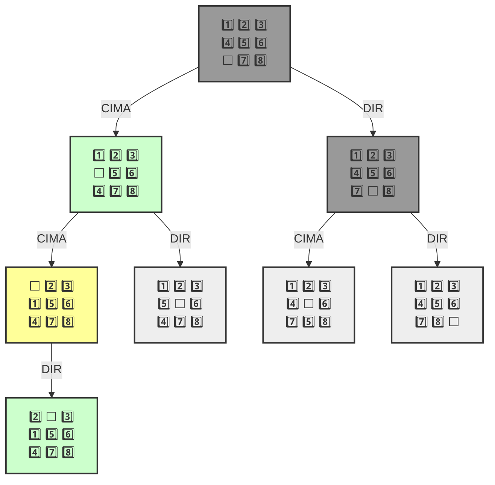

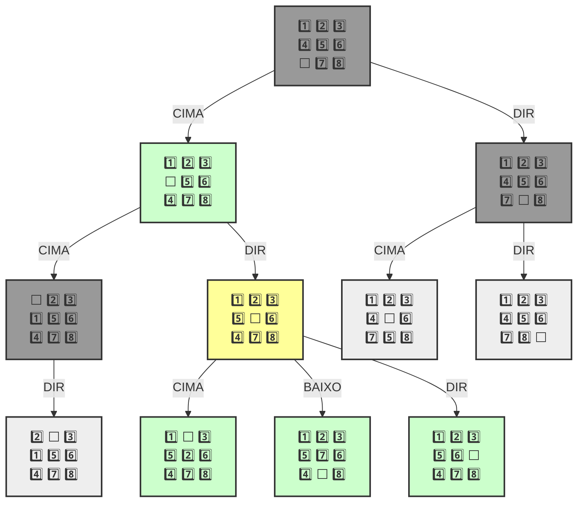

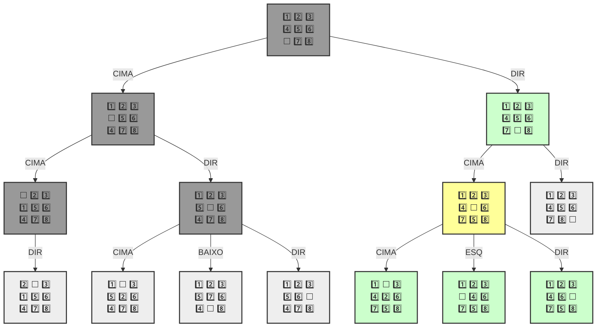


<pre><code>
```mermaid
<strong>
</strong>    
```
🎯 Objetivo encontrado!

1️⃣ 2️⃣ 3️⃣
4️⃣ 5️⃣ 6️⃣
⬜ 7️⃣ 8️⃣ 
---
1️⃣ 2️⃣ 3️⃣
4️⃣ 5️⃣ 6️⃣
7️⃣ ⬜ 8️⃣ 
---
1️⃣ 2️⃣ 3️⃣
4️⃣ 5️⃣ 6️⃣
7️⃣ 8️⃣ ⬜ 
---
</code></pre>

```
[<__main__.Estado at 0x7b237c51e3d0>,
 <__main__.Estado at 0x7b23677e44d0>,
 <__main__.Estado at 0x7b2364626390>]
```


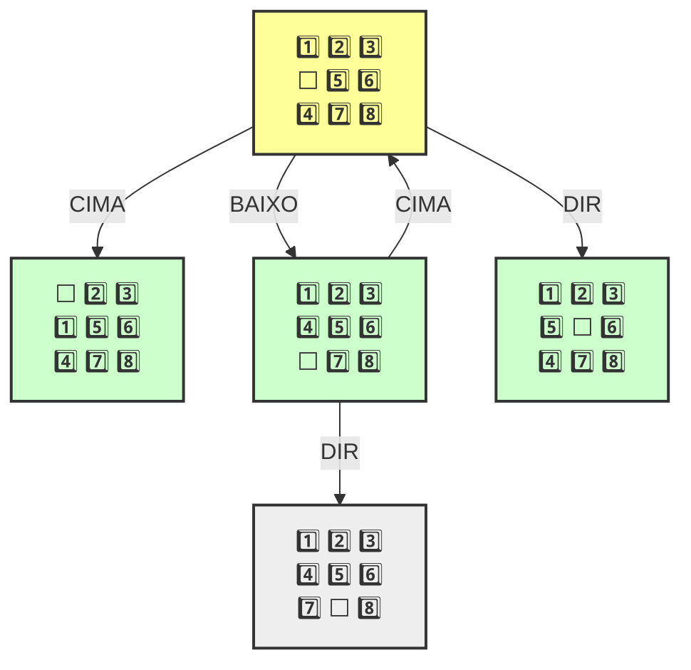


````
```mermaid

    
```
```mermaid

    
```
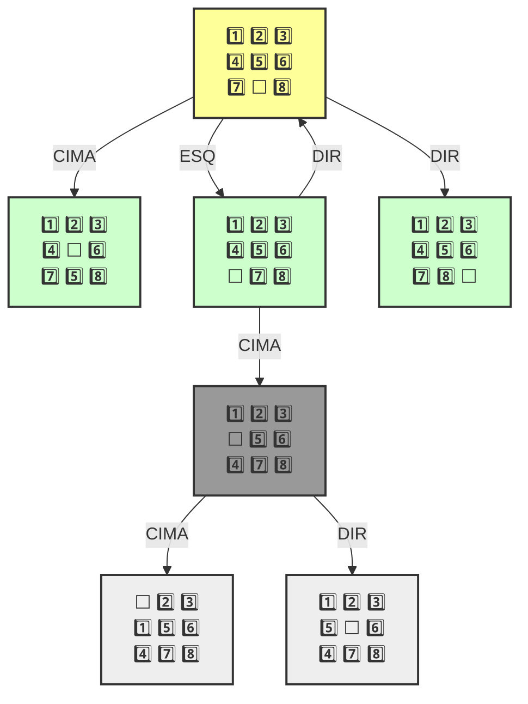
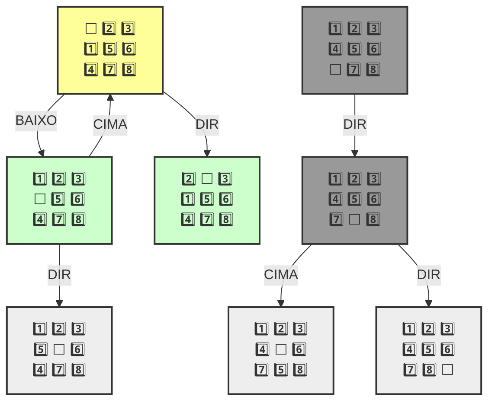
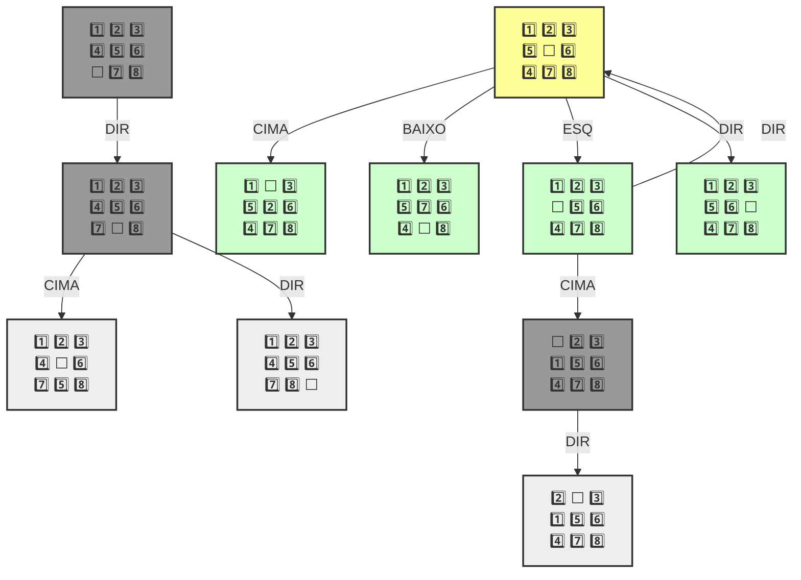
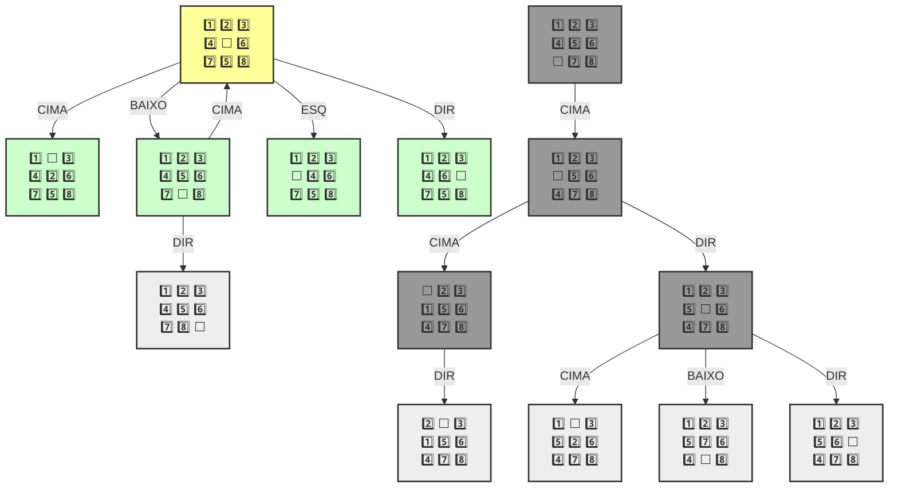
🎯 Objetivo encontrado!

1️⃣ 2️⃣ 3️⃣
4️⃣ 5️⃣ 6️⃣
⬜ 7️⃣ 8️⃣ 
---
1️⃣ 2️⃣ 3️⃣
4️⃣ 5️⃣ 6️⃣
7️⃣ ⬜ 8️⃣ 
---
1️⃣ 2️⃣ 3️⃣
4️⃣ 5️⃣ 6️⃣
7️⃣ 8️⃣ ⬜ 
---
````

```
[<__main__.Estado at 0x7b237c50e310>,
 <__main__.Estado at 0x7b23677b1cd0>,
 <__main__.Estado at 0x7b2364627150>]
 

```

