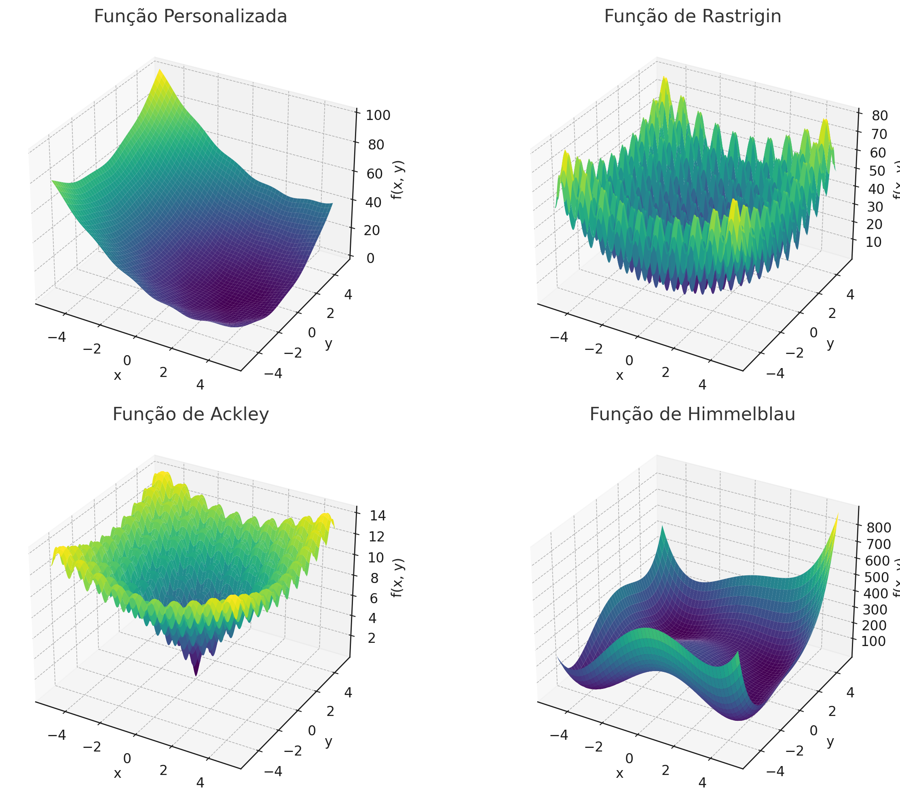

# 🛠️ Oficina 6

## Exercício 1

Utilize o PSO para encontrar os mínimos globais das funções a seguir.&#x20;

**a. Função Personalizada**

$$
f(x, y) = (x - 3)^2 + (y + 1)^2 + \sin(3x) \cdot \cos(2y)
$$

**b. Função de Rastrigin**

$$
f(x, y) = 20 + x^2 + y^2 - 10\left(\cos(2\pi x) + \cos(2\pi y)\right)
$$

**c. Função de Ackley**

$$
f(x, y) = -20 \cdot \exp\left(-0.2 \cdot \sqrt{0.5(x^2 + y^2)}\right) - \exp\left(0.5 \cdot \left[\cos(2\pi x) + \cos(2\pi y)\right]\right) + e + 20
$$

**d. Função de Himmelblau**

$$
f(x, y) = (x^2 + y - 11)^2 + (x + y^2 - 7)^2
$$

<figure><figcaption></figcaption></figure>

Responda:

* Quais os valores de x e y do mínimo de cada função?
* Quais os melhores parâmetros para o PSO sempre convergir para uma solução próxima da ótima?
* É possível encontrar as coordenadas exatas?

## Exercício 2

Modifique o PSO para permitir vizinhaça social de tamanho S. Responda:

* Utilizando uma vizinhaça social, é possível obter melhores resultados?
* Qual o melhor valor de vizinhança para cada problema?
