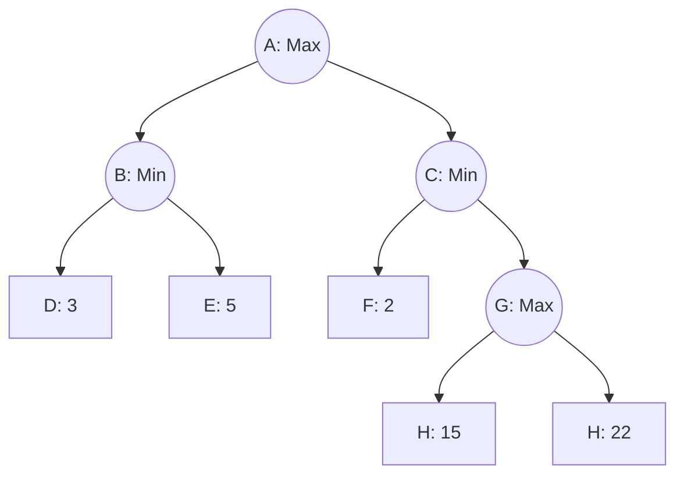
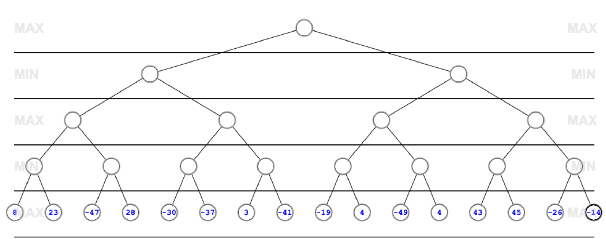

# 📓 Revisão 01

## Questão 1

A Inteligência Artificial (IA) passou por diferentes fases ao longo de sua evolução histórica, caracterizadas por avanços tecnológicos e mudanças de paradigma. A chamada “primeira onda” da IA, que ocorreu entre as décadas de 1950 e 1970, tinha como principal foco:

a. A criação de sistemas especialistas baseados em regras heurísticas e representação simbólica do conhecimento.\
b. O desenvolvimento de redes neurais profundas com múltiplas camadas e aprendizado supervisionado.\
c. A formulação de agentes autônomos com capacidade de adaptação em ambientes dinâmicos.\
d. A modelagem de comportamentos inteligentes por meio de algoritmos genéticos e outras técnicas evolutivas.\
e. A simulação do raciocínio lógico formal em problemas de prova de teoremas e jogos baseados em regras.

<details>

<summary><span data-gb-custom-inline data-tag="emoji" data-code="270f">✏️</span> Resposta</summary>

> **Resposta correta: e. A simulação do raciocínio lógico formal em problemas de prova de teoremas e jogos baseados em regras.**

**Justificativa:**\
A primeira fase da IA, também conhecida como IA simbólica, focava na simulação do raciocínio lógico formal com uso de sistemas baseados em regras e manipulação simbólica. As aplicações mais proeminentes estavam relacionadas à resolução de teoremas e jogos como xadrez, utilizando lógica formal e mecanismos de inferência. Sistemas especialistas (alternativa a) emergiram posteriormente, nos anos 1980. As redes neurais profundas (alternativa b) e as técnicas evolutivas (alternativa d) são características de fases mais recentes da IA.

</details>

## Questão 2

A aplicação da Inteligência Artificial na sociedade contemporânea envolve implicações éticas significativas. Uma das preocupações centrais nesse contexto diz respeito:

a. À baixa eficiência dos algoritmos de busca em tempo real aplicados a sistemas embarcados.\
b. Ao uso de agentes reativos simples em ambientes parcialmente observáveis.\
c. À ausência de padrões formais para representação do conhecimento em lógica de primeira ordem.\
d. À tomada de decisões automatizadas que afetam direitos fundamentais dos cidadãos.\
e. Ao alto custo computacional da implementação de heurísticas admissíveis em A\*.

<details>

<summary><span data-gb-custom-inline data-tag="emoji" data-code="270f">✏️</span> Resposta</summary>

> **Resposta correta: d. À tomada de decisões automatizadas que afetam direitos fundamentais dos cidadãos.**

**Justificativa:**\
A discussão ética em IA envolve temas como transparência algorítmica, viés de dados e responsabilização por decisões automatizadas. Isso se torna especialmente relevante em contextos que envolvem saúde, segurança pública, crédito e processos judiciais. A alternativa correta aborda diretamente o impacto social da IA, conforme previsto nas diretrizes da disciplina. As demais alternativas tratam de aspectos técnicos específicos que não se relacionam diretamente com a dimensão ética e societal da IA.

</details>

## Questão 3

No contexto da Inteligência Artificial, agentes são entidades que percebem o ambiente e agem sobre ele com o objetivo de atingir metas. Um **agente reativo simples** caracteriza-se por:

a. Utilizar modelos internos complexos para prever as consequências futuras de suas ações.\
b. Tomar decisões baseadas unicamente na sequência de estados anteriores, sem percepção atual.\
c. Atuar com base apenas na percepção atual, sem considerar histórico nem planejamento.\
d. Executar planos previamente definidos com base em um modelo completo do ambiente.\
e. Aprender a partir da retroalimentação do ambiente e ajustar seu comportamento com o tempo.

<details>

<summary><span data-gb-custom-inline data-tag="emoji" data-code="270f">✏️</span> Resposta</summary>

> **Resposta correta: c. Atuar com base apenas na percepção atual, sem considerar histórico nem planejamento.**

**Justificativa:**\
Agentes reativos simples operam por meio de regras de condição-ação aplicadas diretamente à percepção atual, sem qualquer tipo de estado interno ou memória. Eles são adequados para ambientes completamente observáveis e estáticos. Diferem dos agentes baseados em modelos (a) e dos agentes com aprendizado (e), que possuem capacidades mais avançadas.

</details>

## Questão 4

Considere um sistema de IA que realiza o monitoramento ambiental de uma floresta e, com base em sensores e imagens térmicas, decide acionar drones para apagar focos de incêndio. Esse agente deve lidar com percepções ruidosas, tomar decisões em tempo real e adaptar seu comportamento conforme novas informações. Esse agente pode ser classificado como:

a. Reativo simples\
b. Baseado em metas\
c. Baseado em aprendizado\
d. Baseado em utilidade\
e. Baseado em regras

<details>

<summary><span data-gb-custom-inline data-tag="emoji" data-code="270f">✏️</span> Resposta</summary>

> **Resposta correta: d. Baseado em utilidade**

**Justificativa:**\
Agentes baseados em utilidade avaliam as possíveis ações de acordo com uma função de utilidade que expressa o grau de preferência por determinados resultados. São apropriados para ambientes complexos, dinâmicos e parcialmente observáveis, como no exemplo descrito. Embora o agente possa incorporar aprendizado (c), a ênfase na avaliação de alternativas segundo um critério de utilidade caracteriza sua classificação primária.

</details>

## Questão 5

A principal diferença entre **agentes baseados em metas** e **agentes baseados em utilidade** é que:

a. Os primeiros reagem a estímulos imediatos, enquanto os segundos aprendem com o ambiente.\
b. Os primeiros consideram apenas os estados finais desejados, enquanto os segundos avaliam múltiplos caminhos possíveis segundo preferências.\
c. Os primeiros possuem memória de estados anteriores, enquanto os segundos utilizam apenas percepção atual.\
d. Os primeiros são determinísticos, enquanto os segundos operam de forma probabilística.\
e. Os primeiros empregam algoritmos heurísticos, enquanto os segundos utilizam lógica proposicional.

<details>

<summary><span data-gb-custom-inline data-tag="emoji" data-code="270f">✏️</span> Resposta</summary>

> **Resposta correta: b. Os primeiros consideram apenas os estados finais desejados, enquanto os segundos avaliam múltiplos caminhos possíveis segundo preferências.**

**Justificativa:**\
Agentes baseados em metas avaliam ações que conduzem ao atingimento de um objetivo específico. Já agentes baseados em utilidade não apenas consideram se uma meta será alcançada, mas também avaliam a "qualidade" dos diferentes estados resultantes, permitindo escolhas mais refinadas em ambientes com múltiplas alternativas. Essa distinção é fundamental na hierarquia de agentes inteligentes.

</details>

## Questão 6

Em relação às **características do ambiente** que influenciam o comportamento de agentes inteligentes, é correto afirmar que:

a. Ambientes determinísticos exigem que o agente utilize aprendizado de máquina para generalizar ações futuras.\
b. Em ambientes parcialmente observáveis, agentes simples são suficientes para resolver problemas complexos.\
c. Ambientes contínuos exigem discretização das ações e percepções para uso de agentes reativos.\
d. Em ambientes estocásticos, as ações têm efeitos imprevisíveis e exigem planejamento probabilístico.\
e. Ambientes acessíveis não exigem que o agente modele ou mantenha estado interno.

<details>

<summary><span data-gb-custom-inline data-tag="emoji" data-code="270f">✏️</span> Resposta</summary>

> **Resposta correta: d. Em ambientes estocásticos, as ações têm efeitos imprevisíveis e exigem planejamento probabilístico.**

**Justificativa:**\
Ambientes estocásticos introduzem incerteza nos resultados das ações do agente, tornando necessário o uso de modelos probabilísticos para tomada de decisão. Isso contrasta com ambientes determinísticos, nos quais a consequência de cada ação é previsível. A afirmação correta descreve adequadamente essa característica e suas implicações no projeto de agentes.

</details>

## Questão 7

Uma empresa de logística automatizada desenvolveu um sistema de planejamento de rotas para drones entregadores em uma cidade com clima altamente variável. O sistema deve reagir a condições climáticas imprevisíveis, modificar sua rota em tempo real e otimizar o consumo de bateria. Para isso, o software precisa interpretar sensores meteorológicos, ajustar seu plano de voo, e considerar obstáculos novos (como manifestações, bloqueios ou ventos intensos) que não estavam previamente mapeados.

Com base no cenário descrito, **a caracterização mais adequada do ambiente em que o agente opera é**:

a. Estático, observável, determinístico, discreto e conhecido.\
b. Dinâmico, parcialmente observável, estocástico, contínuo e desconhecido.\
c. Estático, parcialmente observável, determinístico, discreto e conhecido.\
d. Dinâmico, observável, determinístico, contínuo e conhecido.\
e. Estático, observável, estocástico, discreto e conhecido.

<details>

<summary><span data-gb-custom-inline data-tag="emoji" data-code="270f">✏️</span> Resposta</summary>

> **Resposta correta: b. Dinâmico, parcialmente observável, estocástico, contínuo e desconhecido.**

**Justificativa:**\
O ambiente muda com o tempo (dinâmico), possui informações incompletas (parcialmente observável), envolve incertezas (estocástico), lida com variáveis contínuas (posição, vento, temperatura) e não é totalmente mapeado (desconhecido). Essa caracterização exige do agente estratégias adaptativas e robustas.

</details>

## Questão 8&#x20;

Considere os elementos que compõem a definição formal de um problema de busca em IA: **(1) estado inicial, (2) conjunto de ações, (3) função de transição, (4) teste de objetivo e (5) função de custo**. A seguir, são apresentadas descrições dessas componentes aplicadas a um problema de navegação urbana.

Associe corretamente cada elemento ao seu exemplo correspondente:

**( )** Localização atual do agente em um mapa urbano.\
&#xNAN;**( )** Lista de manobras possíveis: virar à esquerda, seguir reto, virar à direita.\
&#xNAN;**( )** Função que, dada uma posição e uma ação, retorna a nova posição no mapa.\
&#xNAN;**( )** Verificação se o destino final foi alcançado.\
&#xNAN;**( )** Distância acumulada percorrida desde o ponto de origem.

<details>

<summary><span data-gb-custom-inline data-tag="emoji" data-code="270f">✏️</span> Resposta</summary>

> **Resposta correta:**
>
> 1. Localização atual do agente em um mapa urbano.
> 2. Lista de manobras possíveis: virar à esquerda, seguir reto, virar à direita.
> 3. Função que, dada uma posição e uma ação, retorna a nova posição no mapa.
> 4. Verificação se o destino final foi alcançado.
> 5. Distância acumulada percorrida desde o ponto de origem.

**Justificativa:**\
Cada elemento da formulação de um problema de busca em IA tem papel específico. A localização inicial define o estado de partida; as ações possíveis representam as opções de movimento; a função de transição modela a dinâmica do sistema; o teste de objetivo verifica a condição de parada; e a função de custo quantifica o desempenho do percurso.

</details>

## Questão 9&#x20;

Complete a frase a seguir com a alternativa que a torna **correta e tecnicamente precisa**:

**"Em um problema de busca, a \_\_\_\_\_\_ define a relação entre um estado atual e os estados sucessores gerados por ações aplicáveis, sendo crucial para a construção do espaço de busca."**

a. função heurística\
b. função de transição\
c. função de avaliação\
d. função objetivo\
e. função de utilidade

<details>

<summary><span data-gb-custom-inline data-tag="emoji" data-code="270f">✏️</span> Resposta</summary>

> **Resposta correta: b. função de transição**

**Justificativa:**\
A função de transição (também chamada de função sucessora) descreve como o ambiente muda após a execução de uma ação em determinado estado. Ela é responsável pela geração da árvore de busca. Já a função heurística (a) e de avaliação (c) são usadas apenas em algoritmos informados e não caracterizam a estrutura do problema em si.

</details>

## Questão 10&#x20;

Em relação à formulação de problemas em ambientes de busca, considere as afirmações abaixo:

I. Todo problema de busca pode ser resolvido por busca em profundidade, desde que a profundidade máxima seja conhecida.\
II. Problemas com múltiplas soluções exigem algoritmos que explorem todos os caminhos possíveis até encontrar o melhor, independentemente do custo computacional.\
III. A modelagem adequada do espaço de estados pode reduzir significativamente o tempo de busca.\
IV. Em problemas onde o objetivo não é conhecido antecipadamente, o teste de objetivo pode ser substituído por uma heurística que aproxima a solução ideal.

Está **correto apenas o que se afirma em**:

a. I e II\
b. II e III\
c. III\
d. III e IV\
e. I, II e IV

<details>

<summary><span data-gb-custom-inline data-tag="emoji" data-code="270f">✏️</span> Resposta</summary>

> **Resposta correta: c. III**

**Justificativa:**\
A afirmação III é correta, pois a estruturação eficiente do espaço de estados (ex: evitando redundância ou ciclos) pode diminuir o tempo de execução da busca. A I é incorreta, pois a busca em profundidade pode falhar em encontrar a solução se houver ciclos ou caminhos infinitos, mesmo com profundidade conhecida. A II é incorreta por ignorar heurísticas e estratégias de poda. A IV é conceitualmente incorreta: heurísticas não substituem o teste de objetivo, mas guiam a busca até ele.

</details>

## Questão 11

Considere um sistema autônomo de navegação em armazéns logísticos. Este sistema precisa encontrar a menor rota entre prateleiras, respeitando o custo de movimentação entre corredores, que varia conforme obstáculos e largura das passagens. Além disso, é importante que o tempo de resposta seja rápido e que o sistema não consuma memória excessiva.

Dentre os algoritmos de busca abaixo, o **mais apropriado para essa situação, considerando a necessidade de encontrar o caminho ótimo com eficiência de tempo e memória**, é:

a. Busca em profundidade\
b. Busca em largura\
c. Busca gulosa\
d. Busca A\*\
e. Busca em aprofundamento iterativo

<details>

<summary><span data-gb-custom-inline data-tag="emoji" data-code="270f">✏️</span> Resposta</summary>

> **Resposta correta: d. Busca A\***

**Justificativa:**\
A busca A\* (A estrela) combina custo real acumulado (função g(n)) com estimativa heurística do custo restante (função h(n)), proporcionando uma busca eficiente e ótima, desde que a heurística seja admissível. Diferente da busca gulosa, que ignora o custo acumulado, e da profundidade, que não garante otimalidade, o A\* equilibra desempenho e qualidade da solução, sendo adequado a ambientes logísticos com restrições reais de custo.

</details>

## Questão 12&#x20;

Considere o seguinte **pseudocódigo** simplificado de um algoritmo de busca:

```
1. Inicialize a fronteira com o estado inicial
2. Enquanto a fronteira não estiver vazia:
3.     Remova o primeiro nó da fronteira
4.     Se o nó for objetivo, retorne a solução
5.     Expanda o nó e adicione os sucessores ao final da fronteira
```

Este algoritmo corresponde à seguinte estratégia de busca:

a. Busca em profundidade\
b. Busca em largura\
c. Busca A\*\
d. Busca com custo uniforme\
e. Busca bidirecional

<details>

<summary><span data-gb-custom-inline data-tag="emoji" data-code="270f">✏️</span> Resposta</summary>

> **Resposta correta: b. Busca em largura**

**Justificativa:**\
O pseudocódigo descreve uma estratégia de busca **FIFO (First-In, First-Out)**, típica da **busca em largura**, em que os nós gerados mais recentemente são adicionados ao final da fronteira. Isso garante que os nós mais próximos da raiz sejam explorados primeiro. Busca em profundidade usaria pilha (LIFO), A\* exigiria ordenação por função f(n), e custo uniforme ordenaria pela função g(n).

</details>

## Questão 13&#x20;

Associe cada algoritmo de busca à sua **propriedade principal**, considerando comportamento em termos de **completude, otimalidade, uso de heurística e estrutura de dados empregada**:

**( ) Busca em profundidade**\
&#xNAN;**( ) Busca em largura**\
&#xNAN;**( ) Busca gulosa**\
&#xNAN;**( ) Busca A\***

1. Usa função f(n) = g(n) + h(n) com heurística admissível
2. Explora preferencialmente os caminhos com menor profundidade
3. Garante otimalidade desde que o custo de cada ação seja constante
4. Utiliza apenas a estimativa heurística h(n) para ordenar a fronteira

<details>

<summary><span data-gb-custom-inline data-tag="emoji" data-code="270f">✏️</span> Resposta</summary>

> **Resposta correta:**\
> 2 – Busca em profundidade\
> 3 – Busca em largura\
> 4 – Busca gulosa\
> 1 – Busca A\*

**Justificativa:**

* A profundidade explora caminhos mais longos primeiro e não é completa nem ótima.
* A largura é completa e ótima com custo uniforme.
* A gulosa se baseia apenas na heurística h(n), o que pode levar a soluções subótimas.
* O A\* usa tanto o custo real quanto a estimativa heurística para garantir otimalidade com eficiência.

</details>

## Questão 14

Complete a afirmação técnica a seguir com a alternativa **correta**:

**"Para que o algoritmo A\* seja garantidamente ótimo, a heurística utilizada deve ser \_\_\_\_\_\_."**

a. consistente e não-admissível\
b. admissível, mas não necessariamente consistente\
c. heurística qualquer, desde que o espaço de estados seja finito\
d. aleatória, para evitar ciclos e soluções locais\
e. dependente do espaço de busca, desde que monotônica

<details>

<summary><span data-gb-custom-inline data-tag="emoji" data-code="270f">✏️</span> Resposta</summary>

> **Resposta correta: b. admissível, mas não necessariamente consistente**

**Justificativa:**\
Para garantir **otimalidade**, basta que a heurística seja **admissível**, ou seja, nunca superestime o custo até o objetivo. A **consistência (monotonicidade)** é uma propriedade mais forte que a admissibilidade e garante eficiência adicional (não necessidade de reexpandir nós), mas não é obrigatória para a correção do A\*.

</details>

## Questão 15&#x20;

Considere um sistema de recomendação de playlist musical personalizado que ajusta continuamente as preferências do usuário para maximizar a satisfação percebida. A cada nova música avaliada, o sistema explora pequenas alterações na ordem da playlist, buscando melhorar a pontuação total do usuário. O espaço de soluções é vasto e não possui um caminho claro até uma solução ótima global.

Dentre os algoritmos a seguir, o **mais apropriado para essa tarefa**, considerando o caráter **dinâmico, multidimensional e não determinístico** do problema, é:

a. Busca em profundidade\
b. Busca A\*\
c. Hill Climbing\
d. MinMax\
e. Busca em largura

<details>

<summary><span data-gb-custom-inline data-tag="emoji" data-code="270f">✏️</span> Resposta</summary>

> **Resposta correta: c. Hill Climbing**

**Justificativa:**\
Hill Climbing é uma técnica de **busca local** que realiza alterações incrementais em uma solução atual, avaliando a qualidade (ou “altura”) resultante. É apropriada para problemas com espaço de estados contínuo e onde a **meta não é conhecida de antemão**, como em recomendação. A busca A\* requer heurísticas admissíveis e um estado objetivo claro, o que não se aplica neste caso.

</details>

## Questão 16&#x20;

Complete a sentença com a alternativa **mais precisa**:

**“Uma limitação importante do algoritmo de busca local Hill Climbing é que ele pode ficar preso em \_\_\_\_\_\_, o que compromete sua capacidade de encontrar a solução ótima global.”**

a. ciclos infinitos\
b. estados terminais\
c. planícies, cumes e mínimos locais\
d. fronteiras heurísticas\
e. árvores de decisão

<details>

<summary><span data-gb-custom-inline data-tag="emoji" data-code="270f">✏️</span> Resposta</summary>

> **Resposta correta: c. planícies, cumes e mínimos locais**

**Justificativa:**\
Hill Climbing é suscetível a **mínimos locais** (soluções que são melhores que seus vizinhos, mas não ótimas globalmente), **planícies** (regiões com gradiente nulo) e **cumes** (pontos elevados de difícil acesso). Essas características do espaço de busca dificultam a convergência para a solução ideal, justificando o uso de variantes como Simulated Annealing ou algoritmos genéticos.

</details>

## Questão 17&#x20;

Considere as seguintes estratégias de **busca local** e suas respectivas **características**:

**( ) Hill Climbing**\
&#xNAN;**( ) Simulated Annealing**\
&#xNAN;**( ) Tabu Search**

1. Permite movimentos para estados piores de forma controlada para escapar de mínimos locais.
2. Mantém uma lista de estados já visitados para evitar ciclos e retrocessos.
3. Move-se sempre em direção ao melhor vizinho, sem considerar retrocessos.

Associe corretamente cada estratégia à sua característica.

<details>

<summary><span data-gb-custom-inline data-tag="emoji" data-code="270f">✏️</span> Resposta</summary>

> **Resposta correta:**\
> 3 – Hill Climbing\
> 1 – Simulated Annealing\
> 2 – Tabu Search

**Justificativa:**

* Hill Climbing é uma técnica gananciosa que **sempre sobe** na função de avaliação, o que o torna rápido, mas propenso a mínimos locais.
* Simulated Annealing aceita **pioras temporárias** com probabilidade decrescente (simulando resfriamento térmico).
* Tabu Search evita **repetições** mantendo um histórico de estados proibidos (tabu), útil para escapar de ciclos.

***

</details>

## Questão 18&#x20;

Considere um agente que joga xadrez contra um oponente ideal. Para cada estado do jogo, ele avalia todos os movimentos possíveis até certa profundidade, assumindo que o oponente sempre fará a jogada que **minimiza sua chance de vencer**. Esse comportamento é modelado pelo algoritmo **MinMax**.

Sobre a complexidade e o comportamento do MinMax, analise as afirmativas:

I. O algoritmo MinMax explora todo o espaço de possibilidades até encontrar o estado final do jogo, independentemente da profundidade da árvore.\
II. A complexidade temporal do MinMax é exponencial na profundidade da árvore e no fator de ramificação do jogo.\
III. Técnicas como poda alfa-beta podem reduzir significativamente o número de nós avaliados sem afetar o resultado.\
IV. O MinMax é adequado apenas para jogos de soma nula com dois jogadores e estados totalmente observáveis.

Está **correto apenas o que se afirma em**:

a. I e II\
b. II e III\
c. III e IV\
d. II, III e IV\
e. I, III e IV

<details>

<summary><span data-gb-custom-inline data-tag="emoji" data-code="270f">✏️</span> Resposta</summary>

> **Resposta correta: d. II, III e IV**

**Justificativa:**

* A **complexidade do MinMax** é $$O(b^d)$$, com $$b$$ sendo o fator de ramificação e $$d$$ a profundidade da árvore, tornando-o **computacionalmente caro**.
* A **poda alfa-beta** é uma otimização que reduz drasticamente a quantidade de nós avaliados sem alterar o resultado.
* MinMax é aplicável a **jogos de soma zero**, com **dois jogadores**, **movimentos alternados** e **ambiente completamente observável**.
* A afirmativa I é falsa, pois MinMax **não explora todo o espaço** necessariamente — geralmente se utiliza uma profundidade limitada e funções de avaliação heurística.

</details>

## Questão 19&#x20;

Com base no algoritmo MinMax, qual valor o nó raiz (Max) receberá, e qual ramo representa o caminho escolhido?



<details>

<summary><span data-gb-custom-inline data-tag="emoji" data-code="270f">✏️</span> Resposta</summary>

> **Resposta correta:**
>
> * O nó B (Min) escolhe o menor entre 3 e 5 → **3**
> * O nó C (Min) visita C1 e verifica que 2 <= 3&#x20;
>   * Desse modo, C somente poderá escolher valores menores que 2
>   * Sendo assim, como A é Max ele ainda continuará com 3 do ramo B
>   * Assim o ramo G pode ser podado
> * O nó A (Max) escolhe o maior entre B = 3 e  C <= 2 → **3**
> * **Caminho escolhido:** A → B → D

Visualização no simulador: [https://raphsilva.github.io/utilities/minimax\_simulator/](https://raphsilva.github.io/utilities/minimax_simulator/)

</details>

## Questão 20

Com base no algoritmo MinMax, qual valor o nó raiz (Max) receberá, e qual ramo representa o caminho escolhido? Quais nós serão podados?

<figure><figcaption></figcaption></figure>

Utilize o simulador para validar sua resposta: [https://raphsilva.github.io/utilities/minimax\_simulator/](https://raphsilva.github.io/utilities/minimax_simulator/)
